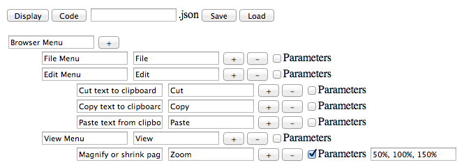
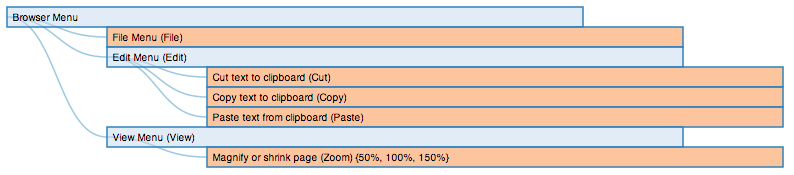

Menu Creator is a javascript tool that helps users create and visualize a menu hierarchy. Starting with the name of the menu at the top, the user then has the option to add child items/menus by clicking the plus '+' button or remove an item by clicking the minus '-' button. Menu items take inputs; function, name, and parameters.

Function should be a short description of what the functionality of that menu item is, for example, often under an 'Edit' menu is item 'Copy', which allows the user to copy text to the clipboard, so for functionality the user would type 'copies selected text to clipboard'. The functionality option helps to make multiple menu hierarchies searchable and comparable later on.

The next field is name, which is what the item is called in the menu. So back to the copy example, the name would be 'Copy' and it would be located under a parent menu named 'Edit'.

Lastly, is parameter and if selected, indicating the menu item has multiple options to choose from, a box appears for that information. An example for this would be the option 'Zoom' under a 'View' Menu where the user has the option to zoom between 50%, 100%, and 150%. The user would then put those options, 50%, 100%, 150%, into the parameters box.

In addition to creating these menus, the user has the option to save their menu creation by clicking the 'Save' button, which they could load (by clicking the 'Load' button) later and either visualize or continue working on, or they can get the code for the json file that would be stored with the menu data by clicking the 'Code' button. The json code is set up to be compatible with the d3.js data visualization library, and the user can view how their menu would look in one visualization instance by selecting the 'Display' button.

